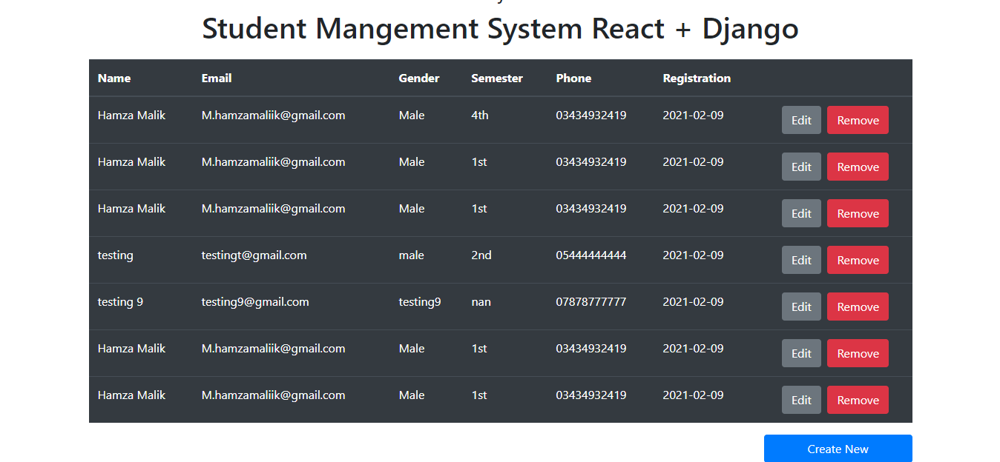
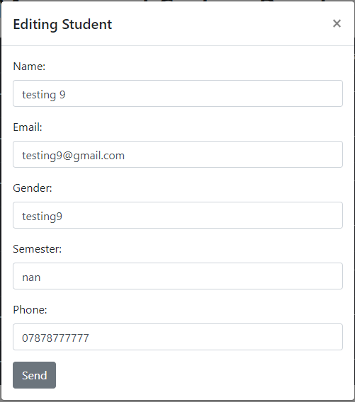

<h1>Student Manegement System </h1>

 Student Mangement system Using Django and react 

For Running the Django server

### `Pyhton manage.py runserver`  
### `http://localhost:8000/api/students`

Make sure before running the react server your django server is running fine.

  

React Frontend
 

For Starting the react Server
 

### `npm start`

 

